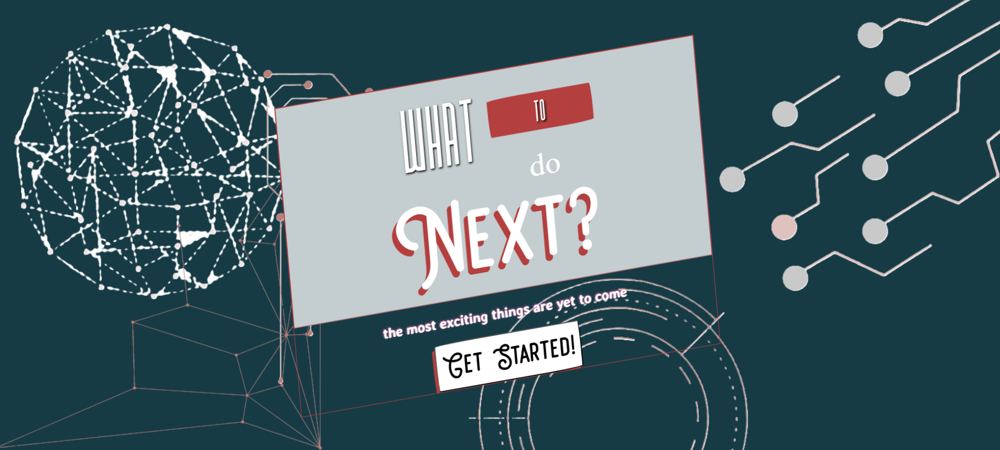

<div align="center">
  

  # What To Do Next? 🚀

  [](https://reactjs.org/)
  [](https://sass-lang.com/)
  [](https://developer.mozilla.org/en-US/docs/Web/JavaScript)
  [](https://choosealicense.com/licenses/mit/)

  <p align="center">
    A dynamic web application that helps users discover their next learning path in technology 🎯
    <br />
    <a href="https://what-to-do-next-olive.vercel.app/">View Demo</a>
    
  </p>
</div>

---

## ✨ Features

<div align="center">
  
</div>

### 🎯 Key Features

- **Age-Based Learning** 
  
  - Personalized paths for different age groups
  - Child-friendly interface for under 15

- **Domain Selection** 
  
  ```
  📱 Mobile Development  |  🌐 Web Development    |  🤖 AI/ML
  🎮 Game Development   |  💻 Software Dev       |  📱 iOS Dev
  🔧 Assembly          |  🔒 Ethical Hacking
  ```


## 🛠️ Tech Stack

<div align="center">
  
  
  
</div>

## Installation 🛠️

1. Clone the repository:
```bash
git clone https://github.com/Vaibhavk121/WhatToDoNext.git
```

2. Install dependencies:
```bash
cd WhatToDoNext
npm install
```

3. Start the development server:
```bash
npm start
```

## Usage 📝

1. Launch the application
2. Enter your name and age
3. Based on age:
   - **Under 15**: Get child-friendly technology recommendations
   - **15+**: Select domains and experience levels
4. Receive personalized learning roadmap
5. Export roadmap as PDF (optional)

## 📁 Project Structure


## 🎯 Demo

<div align="center">
  
</div>

## Contributing 🤝

1. Fork the repository
2. Create your feature branch (`git checkout -b feature/AmazingFeature`)
3. Commit your changes (`git commit -m 'Add some AmazingFeature'`)
4. Push to the branch (`git push origin feature/AmazingFeature`)
5. Open a Pull Request

## License 📄

This project is licensed under the MIT License - see the [LICENSE](LICENSE) file for details.

## Acknowledgments 🙏

- Font assets from Google Fonts and s3-us-west-2.amazonaws.com
- Technology icons from various sources
- Parallax effect inspiration from various web resources

## 📸 Screenshots

<div align="center">
  
  
  
</div>

## 📧 Contact

<div align="center">
  <a href="https://www.linkedin.com/in/vaibhav-kumar-b366872a6">
    
  </a>
  <a href="mailto:vk0606581@gmail.com">
    
  </a>
</div>

---

<div align="center">
  Made with ❤️ using 
</div>
